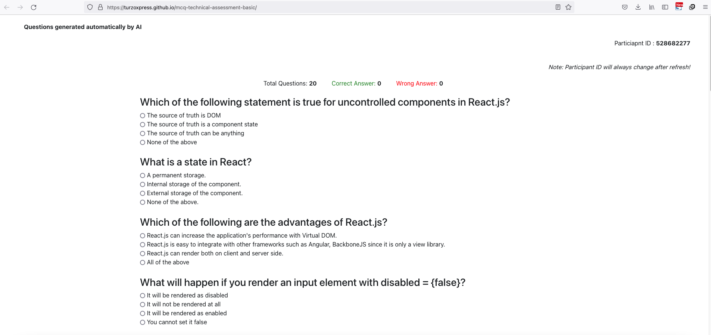

# Online Technical Assessment Template

Do you want to create a serverless online/offline technical assesment website for candidate before the interview?

This template is for you!

## Features

- New questions for assesment from a predefined question set.
- An unique **Particiapant ID** will create automatically,Participant ID will be change everytime while a person refresh the page! To prevent cheating, you have to just write down the ID of a certain candidate.
- No Backend server needed! You have to just add/delete/modify the questions in a simple text file!
- **Github Page Ready!** That means you can deploy this template to Github instantly!
